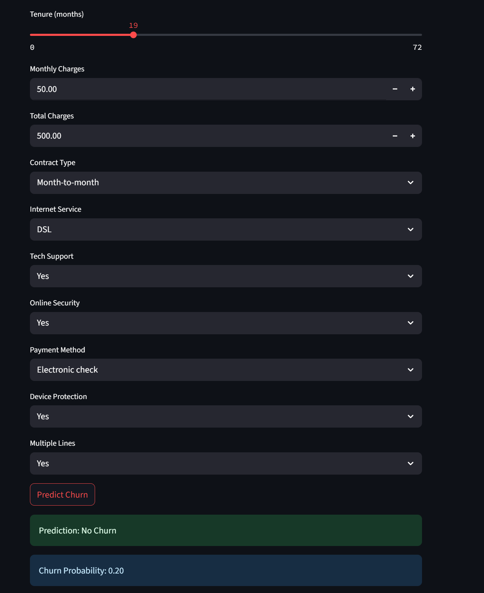

# 🧠 Telco Customer Churn Prediction App
👉 Live App: [Churn Prediction Streamlit App](https://churn-prediction-app-3rdtimeacharm.streamlit.app/)

Customer churn prediction is a crucial business problem where companies identify customers likely to stop using their services. Accurate churn prediction helps businesses proactively retain customers, reduce revenue loss, and optimize marketing efforts.
This app uses a publicly available Telco customer dataset to predict customer churn using machine learning models. It benefits data scientists, business analysts, and stakeholders interested in understanding customer behavior and building actionable predictive tools.

## App Preview

Here is a screenshot of the app interface:

Data and Ethics
The dataset includes customer demographics, services subscribed, account information, and churn status. It has been preprocessed for missing values, categorical encoding, and feature scaling.
Dataset Source: [Telco Customer Churn - Kaggle](https://www.kaggle.com/datasets/blastchar/telco-customer-churn)

This project uses the publicly available Telco Customer Churn dataset sourced from Kaggle / IBM Sample Data. The dataset contains customer demographic information, service subscriptions, account details, and churn labels.

Potential Biases:
The dataset may contain biases based on demographics or regional customer characteristics, which could impact model fairness.
Model predictions are only as good as the data provided; unobserved factors or changes over time may affect accuracy.
The model should not be used as the sole basis for critical decisions without human oversight.

Methodology Overview
Data Preprocessing: Handling missing data, encoding categorical variables, scaling numerical features.
Model Training: Implemented Random Forest and Logistic Regression models.
Model Evaluation: Used accuracy, precision, recall, F1-score, and ROC-AUC to evaluate performance.
Interpretability: Applied SHAP (SHapley Additive exPlanations) to explain feature impact on predictions.
Deployment: Developed an interactive Streamlit app for live customer churn prediction based on user inputs.

Live App: [Churn Prediction Streamlit App](https://churn-prediction-app-3rdtimeacharm.streamlit.app/)  

## 🧪 ML Workflow

### 1. Data Preprocessing
- Removed missing values in `TotalCharges` column.
- Applied label encoding for binary categorical features.
- Used one-hot encoding for multi-class categorical variables.
- Scaled numerical features using `StandardScaler`.

### 2. Model Training
- Algorithms used:
  - ✅ Logistic Regression (as a baseline)
  - ✅ Random Forest Classifier (final model of choice)

### 3. Model Evaluation
- Metrics used:
  - Accuracy
  - F1 Score
  - ROC-AUC Score
- Final model showed strong performance on unseen test data.

### 4. Feature Importance (Explainability)
Used the **feature importance** attribute of the Random Forest model to identify key drivers of churn.
Top contributing features included:
  - `tenure`
  - `Contract`
  - `MonthlyCharges`
  - `PaymentMethod`
Visualized feature importances using bar plots for stakeholder-friendly interpretation. 

### 5. Deployment Instructions

#### Deploying on Streamlit Cloud

1. Create an account at [Streamlit Cloud](https://streamlit.io/cloud).
2. Connect your GitHub repository.
3. Select the repo and branch containing your app.
4. Specify the main script (e.g., `app.py`) to run.
5. Streamlit Cloud will install dependencies from `requirements.txt` and deploy the app.
6. Share the generated app URL with others.

👉 Live App: [Churn Prediction Streamlit App](https://churn-prediction-app-3rdtimeacharm.streamlit.app/)

## 🧰 Tech Stack

| Tool | Purpose |
|------|---------|
| `Python` | Core development |
| `pandas`, `numpy` | Data manipulation |
| `scikit-learn` | Model building |
| `SHAP` | Model explainability |
| `matplotlib`, `seaborn` | EDA visualizations |
| `Streamlit` | App deployment |
| `GitHub` | Source control |
| `Kaggle` | Dataset source |

## Performance and Limitations
The model is trained on a relatively small publicly available dataset (~7,000 samples), which limits generalizability to larger or different customer populations.
Model performance may degrade when applied to data with significantly different distributions or features.
Real-world deployment should include regular model retraining with up-to-date data to maintain accuracy.
Predictions are probabilistic and should be supplemented with business context and human judgment.
The app currently does not handle extreme input cases or invalid data beyond basic validation.

🤝 Collaboration & Feedback
Interested in collaborating? Found a bug? Want to reuse the pipeline?

📬 Reach out on [Linkedin](https://www.linkedin.com/in/oluwatosin-oyeladun-234a8a42/) or open an issue on this repo.
